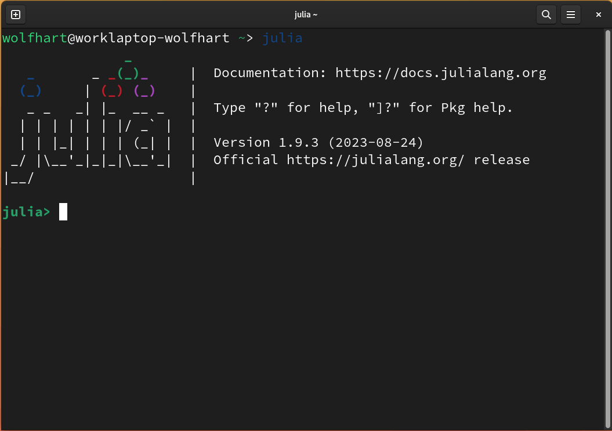

# Literate package development using Julia and Pluto.jl

## Plan for the workshop

* [Crashcourse on Julia](#julia-in-5-minutes) (depending on the prior knowledge of the audience)
* package management in Julia and the typical structure of a package
* introducing Pluto notebooks:
    writing code
    adding text
    visualising results
    adding interactivity (PlutoUI.jl)
    exporting static HTML
* combining different files/notebooks using PlutoLinks.jl and PlutoDevMacros.jl
* integrating interactive tests using PlutoTest.jl
developing an example package using what we learned

## Julia in 5 minutes

### Install Julia

#### Linux and Mac
```bash
curl -fsSL https://install.julialang.org | sh
```
<details>
<summary>(details for other shells than bash)</summary>

Note that on shells other than `bash` you might have to manually add the `~/.juliaup/bin` directory to your `PATH`, e.g. on `fish`: 

```fish
set -U fish_user_paths ~/.juliaup/bin $fish_user_paths
```

Fore more details on `juliaup`, visit https://github.com/JuliaLang/juliaup
</details>

#### Windows
```bash
winget install julia -s msstore
```

<details>
<summary>or  if you prefer a more manual process, expand this section</summary>

got to https://julialang.org/downloads/, download the right archive for your system, extract it and add the contained `bin` directory to your `$PATH`
</details>

### Start Julia

```bash
julia
```


## Creating a Julia package
